# どやまーけ サービス全体 ER設計図

作成日：2026-10-06 ｜ 公開対象 17 サービス ｜ 190 モデル ｜ 197 リレーション

対象はドヤマーケの現行ローカルPrisma定義です。190モデルなどの件数は生成元から計算します。接続先DBの実レコードや本番反映状態はこの図から判断できません。外部サービス内部やStudio CMSの構造は対象外です。

サービス一覧はsrc/lib/services.tsの実getPublicServices()の結果です。公開区分は稼働保証ではありません。Generation.serviceIdやUserServiceSubscription.serviceIdは文字列であり、ServiceへのFKとして描画しません。

ペルソナにはPersonaProject、PersonaImageJob、PersonaImageUsageDay、PersonaUsageDay、PersonaImagePurgeTaskの専用モデルが存在します。旧2026-09-16版の専用モデルなしという記述は現行定義に一致しません。StrategyProjectは別の戦略用定義です。

利用枠・契約者・課金判定の業務仕様はER線だけでは表現できません。src/lib/unified-plan.ts、サービス別quota/admissionと課金実装を併せて確認してください。FKのないID列もアプリでの本人・所属確認が必要です。

ER線は宣言済みrelationFromFieldsとreferencesに対応するものだけです。主キーでもあるFKは一意として1対1にし、親キーが子の主キーに含まれる識別関係は実線、その他は点線です。CunningRecordingLease.sessionIdの主キー兼FKを1対多にする旧生成処理を修正しました。必須/任意・一意制約を示し、親に子が必ず存在することは保証しません。全フィールド、複合一意制約、索引、デフォルトはデータ辞書に収録します。StringやJson内部を推測して新しいテーブルを作り足しません。

旧版と本資料は監査時点の別スナップショットです。全サービス監査・本番通し確認は継続中です。図の更新を不具合ゼロや復旧済みの証拠として扱いません。

## サービス・データ対応表

|サービスID|サービス名|区分|専用モデル数|
|---|---|---|---|
|kantan|カンタンマーケAI|提供終了・非公開|0（専用モデルなし。共通生成履歴等はAPI参照）|
|banner|ドヤバナーAI|公開対象|1|
|logo|ドヤロゴ|提供終了・非公開|0（専用モデルなし。共通生成履歴等はAPI参照）|
|seo|ドヤ記事作成|公開対象|12|
|interview|ドヤインタビュー|公開対象|6|
|shindan|ドヤWeb診断AI|提供終了・非公開|0（専用モデルなし。共通生成履歴等はAPI参照）|
|persona|ドヤペルソナAI|公開対象|5|
|lp|ドヤワイヤーフレーム AI|提供終了・非公開|2|
|video|ドヤ動画AI|提供終了・非公開|0（専用モデルなし。共通生成履歴等はAPI参照）|
|tenkai|ドヤ展開AI|提供終了・非公開|6|
|copy|ドヤコピーAI|提供終了・非公開|3|
|opening|ドヤオープニングAI|提供終了・非公開|2|
|voice|ドヤボイスAI|提供終了・非公開|2|
|presentation|ドヤプレゼンAI|提供終了・非公開|0（専用モデルなし。共通生成履歴等はAPI参照）|
|interviewx|ドヤヒヤリングAI|提供終了・非公開|9|
|movie|ドヤムービーAI|提供終了・非公開|3|
|adsim|ドヤ広告シミュレーションAI|提供終了・非公開|1|
|hr|ドヤHR|公開対象|10|
|kintai|ドヤ勤怠|公開対象|8|
|doyalist|ドヤリスト|公開対象|4|
|doyaslide|ドヤスライド|公開対象|5|
|cunning|ドヤカンニング|公開対象|10|
|promane|ドヤプロマネ|公開対象|9|
|sfa|ドヤ営業管理|公開対象|11|
|shodan|ドヤ商談準備|公開対象|4|
|aio|ドヤAIO|公開対象|6|
|adbanner|ドヤ広告バナーAI|提供終了・非公開|2|
|mensetsu|ドヤ面接官|公開対象|11|
|quote|ドヤ見積もりAI|公開対象|6|
|aishodan|ドヤAI商談|公開対象|12|
|adimage|ドヤ広告画像AI|公開対象|5|

## 読み方

index.html を開き、左のサービスを選択してください。SVG保存・Mermaid保存ができます。全モデル統合図は広いため、サービス別図を推奨します。

## 共通基盤の要約（抜粋）

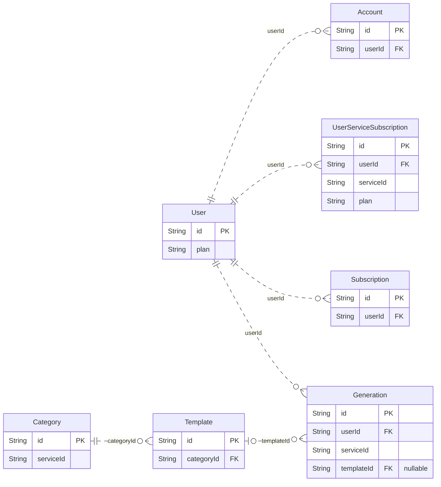
```mermaid
erDiagram
    direction LR
    Account {
        String id PK
        String userId FK
    }
    User {
        String id PK
        String plan
    }
    UserServiceSubscription {
        String id PK
        String userId FK
        String serviceId
        String plan
    }
    Subscription {
        String id PK
        String userId FK
    }
    Category {
        String id PK
        String serviceId
    }
    Template {
        String id PK
        String categoryId FK
    }
    Generation {
        String id PK
        String userId FK
        String serviceId
        String templateId FK "nullable"
    }
    User ||..o{ Account : "userId"
    User ||..o{ UserServiceSubscription : "userId"
    User ||..o{ Subscription : "userId"
    Category ||..o{ Template : "categoryId"
    User ||..o{ Generation : "userId"
    Template |o..o{ Generation : "templateId"
```

## 共通基盤・認証・課金

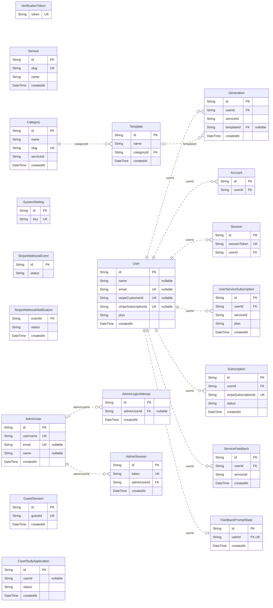
```mermaid
erDiagram
    direction LR
    Account {
        String id PK
        String userId FK
    }
    Session {
        String id PK
        String sessionToken UK
        String userId FK
    }
    VerificationToken {
        String token UK
    }
    User {
        String id PK
        String name "nullable"
        String email UK "nullable"
        String stripeCustomerId UK "nullable"
        String stripeSubscriptionId UK "nullable"
        String plan
        DateTime createdAt
    }
    UserServiceSubscription {
        String id PK
        String userId FK
        String serviceId
        String plan
        DateTime createdAt
    }
    Subscription {
        String id PK
        String userId FK
        String stripeSubscriptionId UK
        String status
        DateTime createdAt
    }
    Service {
        String id PK
        String slug UK
        String name
        DateTime createdAt
    }
    Category {
        String id PK
        String name
        String slug UK
        String serviceId
        DateTime createdAt
    }
    Template {
        String id PK
        String name
        String categoryId FK
        DateTime createdAt
    }
    Generation {
        String id PK
        String userId FK
        String serviceId
        String templateId FK "nullable"
        DateTime createdAt
    }
    SystemSetting {
        String id PK
        String key UK
    }
    StripeWebhookEvent {
        String id PK
        String status
    }
    StripeWebhookNotification {
        String eventId PK
        String status
        DateTime createdAt
    }
    AdminUser {
        String id PK
        String username UK
        String email UK "nullable"
        String name "nullable"
        DateTime createdAt
    }
    AdminLoginAttempt {
        String id PK
        String adminUserId FK "nullable"
        DateTime createdAt
    }
    AdminSession {
        String id PK
        String token UK
        String adminUserId FK
        DateTime createdAt
    }
    GuestSession {
        String id PK
        String guestId UK
        DateTime createdAt
    }
    ServiceFeedback {
        String id PK
        String userId FK
        String serviceId
        DateTime createdAt
    }
    FeedbackPromptState {
        String id PK
        String userId FK,UK
        DateTime createdAt
    }
    CaseStudyApplication {
        String id PK
        String userId "nullable"
        String status
        DateTime createdAt
    }
    User ||..o{ Account : "userId"
    User ||..o{ Session : "userId"
    User ||..o{ UserServiceSubscription : "userId"
    User ||..o{ Subscription : "userId"
    Category ||..o{ Template : "categoryId"
    User ||..o{ Generation : "userId"
    Template |o..o{ Generation : "templateId"
    AdminUser |o..o{ AdminLoginAttempt : "adminUserId"
    AdminUser ||..o{ AdminSession : "adminUserId"
    User ||..o{ ServiceFeedback : "userId"
    User ||..o| FeedbackPromptState : "userId"
```

## ドヤバナーAI

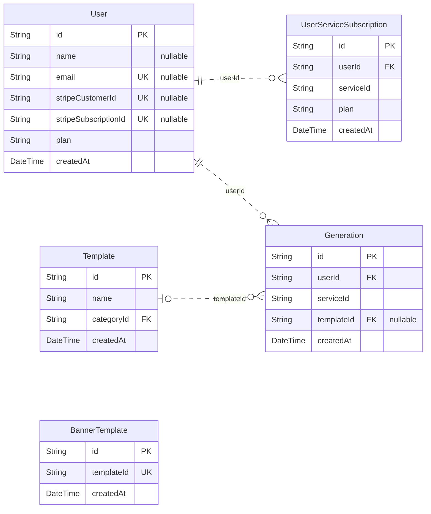
```mermaid
erDiagram
    direction LR
    User {
        String id PK
        String name "nullable"
        String email UK "nullable"
        String stripeCustomerId UK "nullable"
        String stripeSubscriptionId UK "nullable"
        String plan
        DateTime createdAt
    }
    UserServiceSubscription {
        String id PK
        String userId FK
        String serviceId
        String plan
        DateTime createdAt
    }
    Template {
        String id PK
        String name
        String categoryId FK
        DateTime createdAt
    }
    Generation {
        String id PK
        String userId FK
        String serviceId
        String templateId FK "nullable"
        DateTime createdAt
    }
    BannerTemplate {
        String id PK
        String templateId UK
        DateTime createdAt
    }
    User ||..o{ UserServiceSubscription : "userId"
    User ||..o{ Generation : "userId"
    Template |o..o{ Generation : "templateId"
```

## ドヤ記事作成

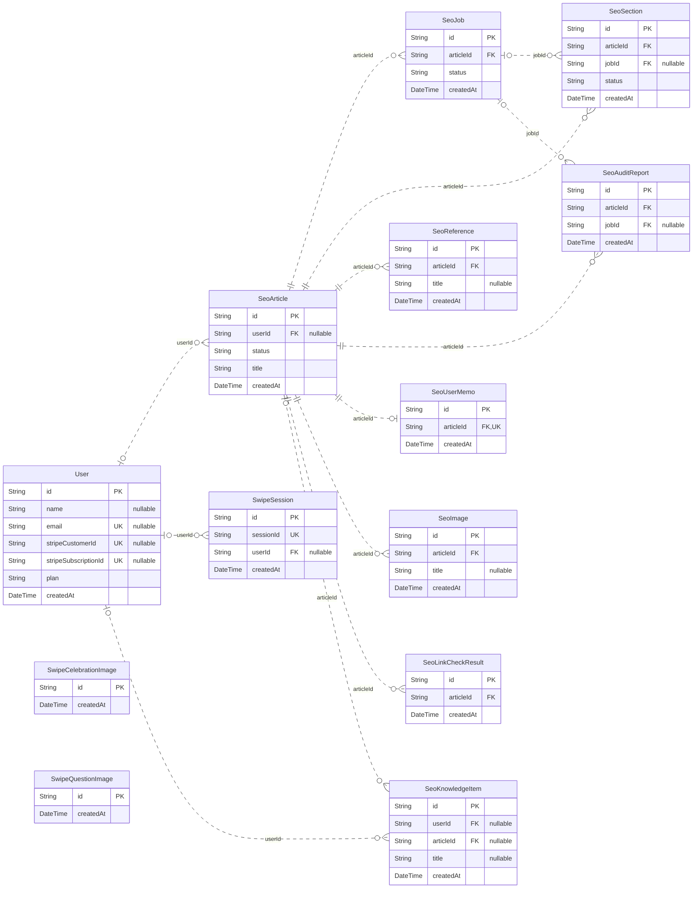
```mermaid
erDiagram
    direction LR
    User {
        String id PK
        String name "nullable"
        String email UK "nullable"
        String stripeCustomerId UK "nullable"
        String stripeSubscriptionId UK "nullable"
        String plan
        DateTime createdAt
    }
    SeoArticle {
        String id PK
        String userId FK "nullable"
        String status
        String title
        DateTime createdAt
    }
    SwipeSession {
        String id PK
        String sessionId UK
        String userId FK "nullable"
        DateTime createdAt
    }
    SwipeCelebrationImage {
        String id PK
        DateTime createdAt
    }
    SwipeQuestionImage {
        String id PK
        DateTime createdAt
    }
    SeoJob {
        String id PK
        String articleId FK
        String status
        DateTime createdAt
    }
    SeoSection {
        String id PK
        String articleId FK
        String jobId FK "nullable"
        String status
        DateTime createdAt
    }
    SeoReference {
        String id PK
        String articleId FK
        String title "nullable"
        DateTime createdAt
    }
    SeoAuditReport {
        String id PK
        String articleId FK
        String jobId FK "nullable"
        DateTime createdAt
    }
    SeoUserMemo {
        String id PK
        String articleId FK,UK
        DateTime createdAt
    }
    SeoImage {
        String id PK
        String articleId FK
        String title "nullable"
        DateTime createdAt
    }
    SeoLinkCheckResult {
        String id PK
        String articleId FK
        DateTime createdAt
    }
    SeoKnowledgeItem {
        String id PK
        String userId FK "nullable"
        String articleId FK "nullable"
        String title "nullable"
        DateTime createdAt
    }
    User |o..o{ SeoArticle : "userId"
    User |o..o{ SwipeSession : "userId"
    SeoArticle ||..o{ SeoJob : "articleId"
    SeoArticle ||..o{ SeoSection : "articleId"
    SeoJob |o..o{ SeoSection : "jobId"
    SeoArticle ||..o{ SeoReference : "articleId"
    SeoArticle ||..o{ SeoAuditReport : "articleId"
    SeoJob |o..o{ SeoAuditReport : "jobId"
    SeoArticle ||..o| SeoUserMemo : "articleId"
    SeoArticle ||..o{ SeoImage : "articleId"
    SeoArticle ||..o{ SeoLinkCheckResult : "articleId"
    User |o..o{ SeoKnowledgeItem : "userId"
    SeoArticle |o..o{ SeoKnowledgeItem : "articleId"
```

## ドヤインタビュー

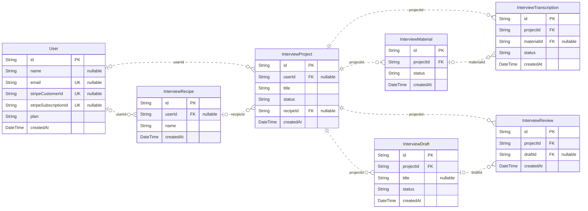
```mermaid
erDiagram
    direction LR
    User {
        String id PK
        String name "nullable"
        String email UK "nullable"
        String stripeCustomerId UK "nullable"
        String stripeSubscriptionId UK "nullable"
        String plan
        DateTime createdAt
    }
    InterviewProject {
        String id PK
        String userId FK "nullable"
        String title
        String status
        String recipeId FK "nullable"
        DateTime createdAt
    }
    InterviewRecipe {
        String id PK
        String userId FK "nullable"
        String name
        DateTime createdAt
    }
    InterviewMaterial {
        String id PK
        String projectId FK
        String status
        DateTime createdAt
    }
    InterviewTranscription {
        String id PK
        String projectId FK
        String materialId FK "nullable"
        String status
        DateTime createdAt
    }
    InterviewReview {
        String id PK
        String projectId FK
        String draftId FK "nullable"
        DateTime createdAt
    }
    InterviewDraft {
        String id PK
        String projectId FK
        String title "nullable"
        String status
        DateTime createdAt
    }
    User |o..o{ InterviewProject : "userId"
    InterviewRecipe |o..o{ InterviewProject : "recipeId"
    User |o..o{ InterviewRecipe : "userId"
    InterviewProject ||..o{ InterviewMaterial : "projectId"
    InterviewProject ||..o{ InterviewTranscription : "projectId"
    InterviewMaterial |o..o{ InterviewTranscription : "materialId"
    InterviewProject ||..o{ InterviewReview : "projectId"
    InterviewDraft |o..o{ InterviewReview : "draftId"
    InterviewProject ||..o{ InterviewDraft : "projectId"
```

## ドヤペルソナAI

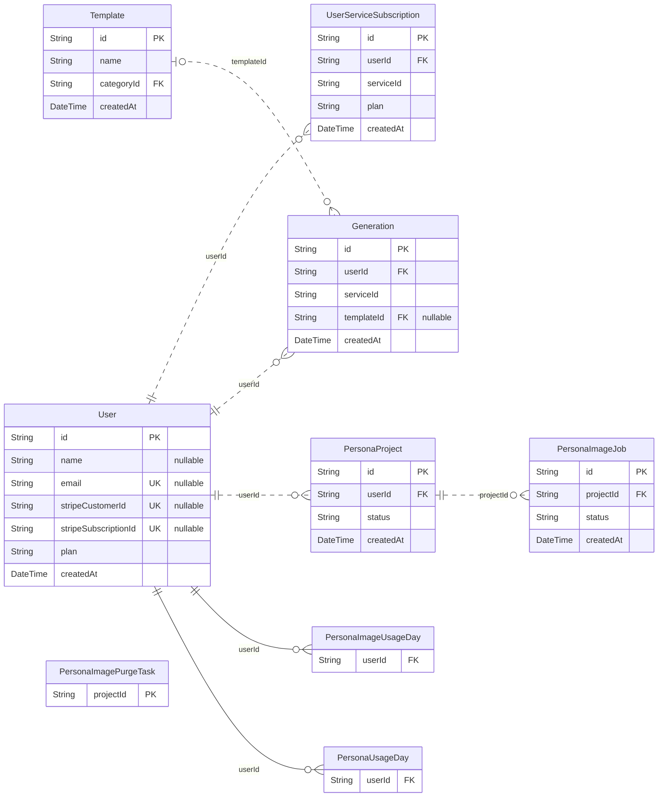
```mermaid
erDiagram
    direction LR
    User {
        String id PK
        String name "nullable"
        String email UK "nullable"
        String stripeCustomerId UK "nullable"
        String stripeSubscriptionId UK "nullable"
        String plan
        DateTime createdAt
    }
    UserServiceSubscription {
        String id PK
        String userId FK
        String serviceId
        String plan
        DateTime createdAt
    }
    Template {
        String id PK
        String name
        String categoryId FK
        DateTime createdAt
    }
    Generation {
        String id PK
        String userId FK
        String serviceId
        String templateId FK "nullable"
        DateTime createdAt
    }
    PersonaImagePurgeTask {
        String projectId PK
    }
    PersonaProject {
        String id PK
        String userId FK
        String status
        DateTime createdAt
    }
    PersonaImageJob {
        String id PK
        String projectId FK
        String status
        DateTime createdAt
    }
    PersonaImageUsageDay {
        String userId FK
    }
    PersonaUsageDay {
        String userId FK
    }
    User ||..o{ UserServiceSubscription : "userId"
    User ||..o{ Generation : "userId"
    Template |o..o{ Generation : "templateId"
    User ||..o{ PersonaProject : "userId"
    PersonaProject ||..o{ PersonaImageJob : "projectId"
    User ||--o{ PersonaImageUsageDay : "userId"
    User ||--o{ PersonaUsageDay : "userId"
```

## ドヤHR

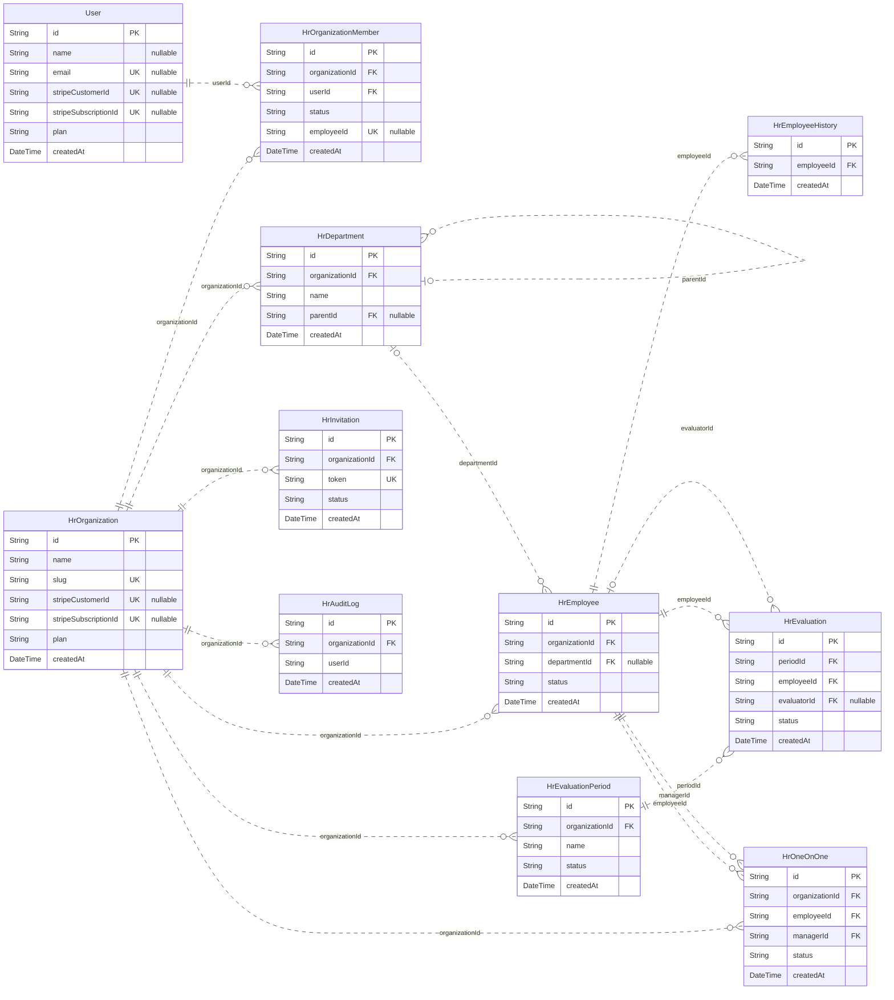
```mermaid
erDiagram
    direction LR
    User {
        String id PK
        String name "nullable"
        String email UK "nullable"
        String stripeCustomerId UK "nullable"
        String stripeSubscriptionId UK "nullable"
        String plan
        DateTime createdAt
    }
    HrOrganization {
        String id PK
        String name
        String slug UK
        String stripeCustomerId UK "nullable"
        String stripeSubscriptionId UK "nullable"
        String plan
        DateTime createdAt
    }
    HrOrganizationMember {
        String id PK
        String organizationId FK
        String userId FK
        String status
        String employeeId UK "nullable"
        DateTime createdAt
    }
    HrDepartment {
        String id PK
        String organizationId FK
        String name
        String parentId FK "nullable"
        DateTime createdAt
    }
    HrEmployee {
        String id PK
        String organizationId FK
        String departmentId FK "nullable"
        String status
        DateTime createdAt
    }
    HrEmployeeHistory {
        String id PK
        String employeeId FK
        DateTime createdAt
    }
    HrEvaluationPeriod {
        String id PK
        String organizationId FK
        String name
        String status
        DateTime createdAt
    }
    HrEvaluation {
        String id PK
        String periodId FK
        String employeeId FK
        String evaluatorId FK "nullable"
        String status
        DateTime createdAt
    }
    HrOneOnOne {
        String id PK
        String organizationId FK
        String employeeId FK
        String managerId FK
        String status
        DateTime createdAt
    }
    HrInvitation {
        String id PK
        String organizationId FK
        String token UK
        String status
        DateTime createdAt
    }
    HrAuditLog {
        String id PK
        String organizationId FK
        String userId
        DateTime createdAt
    }
    HrOrganization ||..o{ HrOrganizationMember : "organizationId"
    User ||..o{ HrOrganizationMember : "userId"
    HrOrganization ||..o{ HrDepartment : "organizationId"
    HrDepartment |o..o{ HrDepartment : "parentId"
    HrOrganization ||..o{ HrEmployee : "organizationId"
    HrDepartment |o..o{ HrEmployee : "departmentId"
    HrEmployee ||..o{ HrEmployeeHistory : "employeeId"
    HrOrganization ||..o{ HrEvaluationPeriod : "organizationId"
    HrEvaluationPeriod ||..o{ HrEvaluation : "periodId"
    HrEmployee ||..o{ HrEvaluation : "employeeId"
    HrEmployee |o..o{ HrEvaluation : "evaluatorId"
    HrOrganization ||..o{ HrOneOnOne : "organizationId"
    HrEmployee ||..o{ HrOneOnOne : "employeeId"
    HrEmployee ||..o{ HrOneOnOne : "managerId"
    HrOrganization ||..o{ HrInvitation : "organizationId"
    HrOrganization ||..o{ HrAuditLog : "organizationId"
```

## ドヤ勤怠

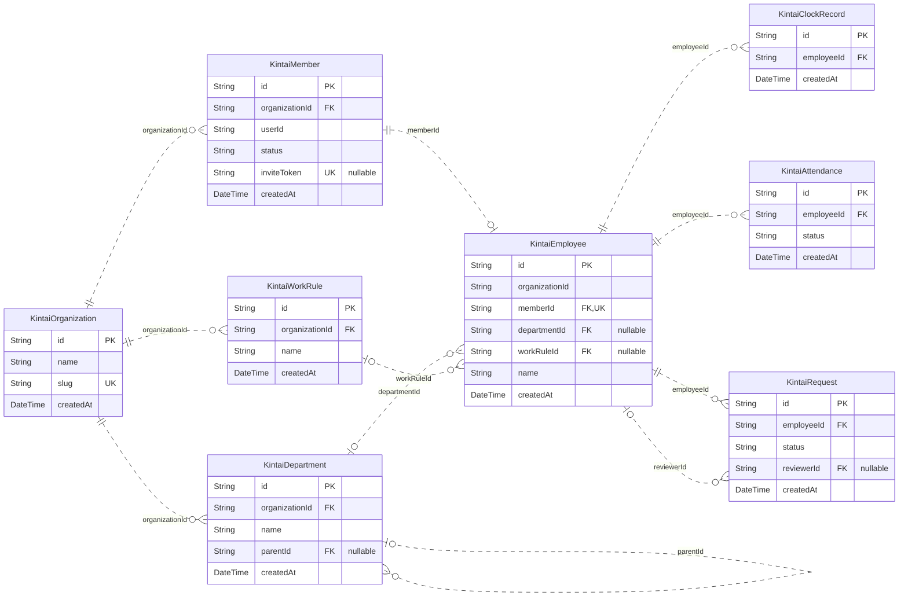
```mermaid
erDiagram
    direction LR
    KintaiOrganization {
        String id PK
        String name
        String slug UK
        DateTime createdAt
    }
    KintaiMember {
        String id PK
        String organizationId FK
        String userId
        String status
        String inviteToken UK "nullable"
        DateTime createdAt
    }
    KintaiDepartment {
        String id PK
        String organizationId FK
        String name
        String parentId FK "nullable"
        DateTime createdAt
    }
    KintaiWorkRule {
        String id PK
        String organizationId FK
        String name
        DateTime createdAt
    }
    KintaiEmployee {
        String id PK
        String organizationId
        String memberId FK,UK
        String departmentId FK "nullable"
        String workRuleId FK "nullable"
        String name
        DateTime createdAt
    }
    KintaiClockRecord {
        String id PK
        String employeeId FK
        DateTime createdAt
    }
    KintaiAttendance {
        String id PK
        String employeeId FK
        String status
        DateTime createdAt
    }
    KintaiRequest {
        String id PK
        String employeeId FK
        String status
        String reviewerId FK "nullable"
        DateTime createdAt
    }
    KintaiOrganization ||..o{ KintaiMember : "organizationId"
    KintaiOrganization ||..o{ KintaiDepartment : "organizationId"
    KintaiDepartment |o..o{ KintaiDepartment : "parentId"
    KintaiOrganization ||..o{ KintaiWorkRule : "organizationId"
    KintaiMember ||..o| KintaiEmployee : "memberId"
    KintaiDepartment |o..o{ KintaiEmployee : "departmentId"
    KintaiWorkRule |o..o{ KintaiEmployee : "workRuleId"
    KintaiEmployee ||..o{ KintaiClockRecord : "employeeId"
    KintaiEmployee ||..o{ KintaiAttendance : "employeeId"
    KintaiEmployee ||..o{ KintaiRequest : "employeeId"
    KintaiEmployee |o..o{ KintaiRequest : "reviewerId"
```

## ドヤリスト

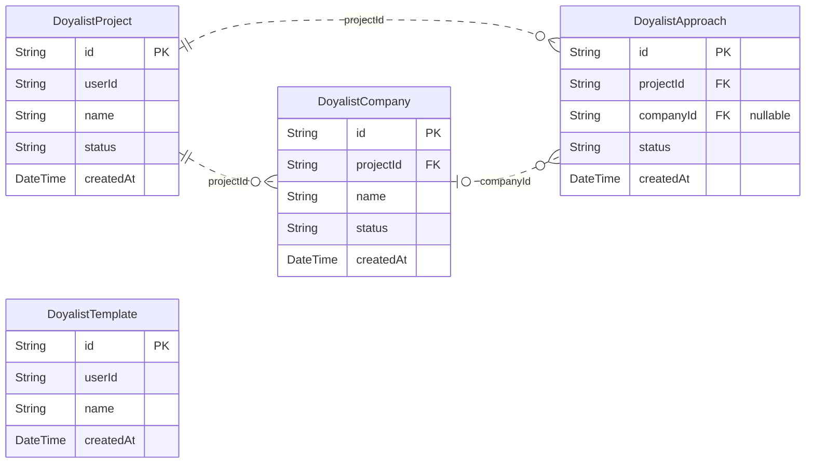
```mermaid
erDiagram
    direction LR
    DoyalistProject {
        String id PK
        String userId
        String name
        String status
        DateTime createdAt
    }
    DoyalistCompany {
        String id PK
        String projectId FK
        String name
        String status
        DateTime createdAt
    }
    DoyalistApproach {
        String id PK
        String projectId FK
        String companyId FK "nullable"
        String status
        DateTime createdAt
    }
    DoyalistTemplate {
        String id PK
        String userId
        String name
        DateTime createdAt
    }
    DoyalistProject ||..o{ DoyalistCompany : "projectId"
    DoyalistProject ||..o{ DoyalistApproach : "projectId"
    DoyalistCompany |o..o{ DoyalistApproach : "companyId"
```

## ドヤスライド

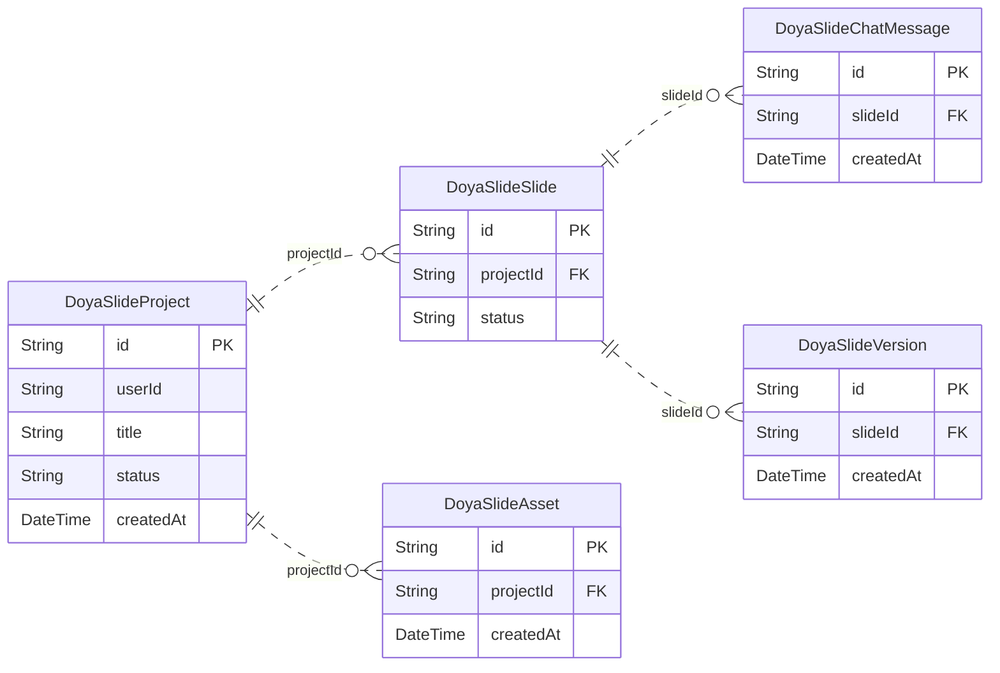
```mermaid
erDiagram
    direction LR
    DoyaSlideProject {
        String id PK
        String userId
        String title
        String status
        DateTime createdAt
    }
    DoyaSlideSlide {
        String id PK
        String projectId FK
        String status
    }
    DoyaSlideAsset {
        String id PK
        String projectId FK
        DateTime createdAt
    }
    DoyaSlideChatMessage {
        String id PK
        String slideId FK
        DateTime createdAt
    }
    DoyaSlideVersion {
        String id PK
        String slideId FK
        DateTime createdAt
    }
    DoyaSlideProject ||..o{ DoyaSlideSlide : "projectId"
    DoyaSlideProject ||..o{ DoyaSlideAsset : "projectId"
    DoyaSlideSlide ||..o{ DoyaSlideChatMessage : "slideId"
    DoyaSlideSlide ||..o{ DoyaSlideVersion : "slideId"
```

## ドヤカンニング

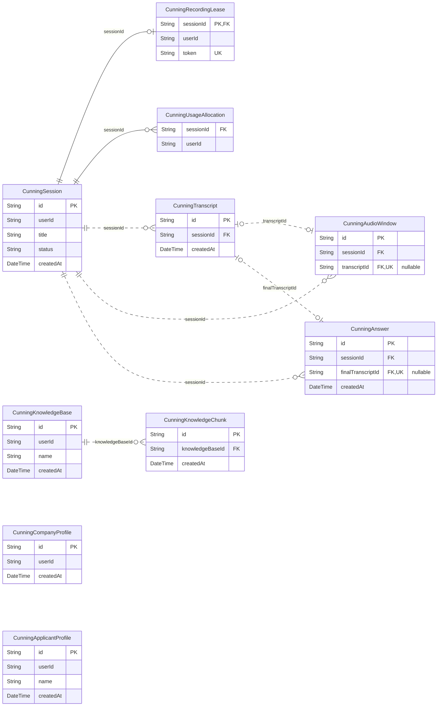
```mermaid
erDiagram
    direction LR
    CunningSession {
        String id PK
        String userId
        String title
        String status
        DateTime createdAt
    }
    CunningRecordingLease {
        String sessionId PK,FK
        String userId
        String token UK
    }
    CunningUsageAllocation {
        String sessionId FK
        String userId
    }
    CunningTranscript {
        String id PK
        String sessionId FK
        DateTime createdAt
    }
    CunningAudioWindow {
        String id PK
        String sessionId FK
        String transcriptId FK,UK "nullable"
    }
    CunningAnswer {
        String id PK
        String sessionId FK
        String finalTranscriptId FK,UK "nullable"
        DateTime createdAt
    }
    CunningKnowledgeBase {
        String id PK
        String userId
        String name
        DateTime createdAt
    }
    CunningKnowledgeChunk {
        String id PK
        String knowledgeBaseId FK
        DateTime createdAt
    }
    CunningCompanyProfile {
        String id PK
        String userId
        DateTime createdAt
    }
    CunningApplicantProfile {
        String id PK
        String userId
        String name
        DateTime createdAt
    }
    CunningSession ||--o| CunningRecordingLease : "sessionId"
    CunningSession ||--o{ CunningUsageAllocation : "sessionId"
    CunningSession ||..o{ CunningTranscript : "sessionId"
    CunningSession ||..o{ CunningAudioWindow : "sessionId"
    CunningTranscript |o..o| CunningAudioWindow : "transcriptId"
    CunningSession ||..o{ CunningAnswer : "sessionId"
    CunningTranscript |o..o| CunningAnswer : "finalTranscriptId"
    CunningKnowledgeBase ||..o{ CunningKnowledgeChunk : "knowledgeBaseId"
```

## ドヤプロマネ

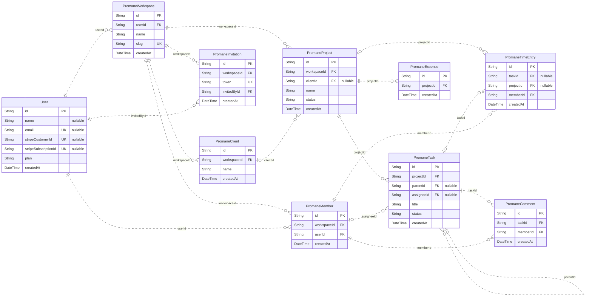
```mermaid
erDiagram
    direction LR
    User {
        String id PK
        String name "nullable"
        String email UK "nullable"
        String stripeCustomerId UK "nullable"
        String stripeSubscriptionId UK "nullable"
        String plan
        DateTime createdAt
    }
    PromaneWorkspace {
        String id PK
        String userId FK
        String name
        String slug UK
        DateTime createdAt
    }
    PromaneMember {
        String id PK
        String workspaceId FK
        String userId FK
        DateTime createdAt
    }
    PromaneClient {
        String id PK
        String workspaceId FK
        String name
        DateTime createdAt
    }
    PromaneProject {
        String id PK
        String workspaceId FK
        String clientId FK "nullable"
        String name
        String status
        DateTime createdAt
    }
    PromaneTask {
        String id PK
        String projectId FK
        String parentId FK "nullable"
        String assigneeId FK "nullable"
        String title
        String status
        DateTime createdAt
    }
    PromaneTimeEntry {
        String id PK
        String taskId FK "nullable"
        String projectId FK "nullable"
        String memberId FK
        DateTime createdAt
    }
    PromaneExpense {
        String id PK
        String projectId FK
        DateTime createdAt
    }
    PromaneComment {
        String id PK
        String taskId FK
        String memberId FK
        DateTime createdAt
    }
    PromaneInvitation {
        String id PK
        String workspaceId FK
        String token UK
        String invitedById FK
        DateTime createdAt
    }
    User ||..o{ PromaneWorkspace : "userId"
    PromaneWorkspace ||..o{ PromaneMember : "workspaceId"
    User ||..o{ PromaneMember : "userId"
    PromaneWorkspace ||..o{ PromaneClient : "workspaceId"
    PromaneWorkspace ||..o{ PromaneProject : "workspaceId"
    PromaneClient |o..o{ PromaneProject : "clientId"
    PromaneProject ||..o{ PromaneTask : "projectId"
    PromaneTask |o..o{ PromaneTask : "parentId"
    PromaneMember |o..o{ PromaneTask : "assigneeId"
    PromaneProject |o..o{ PromaneTimeEntry : "projectId"
    PromaneTask |o..o{ PromaneTimeEntry : "taskId"
    PromaneMember ||..o{ PromaneTimeEntry : "memberId"
    PromaneProject ||..o{ PromaneExpense : "projectId"
    PromaneTask ||..o{ PromaneComment : "taskId"
    PromaneMember ||..o{ PromaneComment : "memberId"
    PromaneWorkspace ||..o{ PromaneInvitation : "workspaceId"
    User ||..o{ PromaneInvitation : "invitedById"
```

## ドヤ営業管理

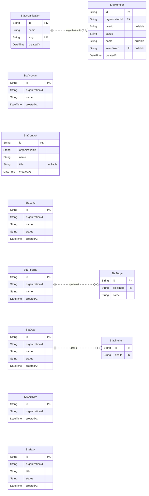
```mermaid
erDiagram
    direction LR
    SfaOrganization {
        String id PK
        String name
        String slug UK
        DateTime createdAt
    }
    SfaMember {
        String id PK
        String organizationId FK
        String userId "nullable"
        String status
        String name "nullable"
        String inviteToken UK "nullable"
        DateTime createdAt
    }
    SfaAccount {
        String id PK
        String organizationId
        String name
        DateTime createdAt
    }
    SfaContact {
        String id PK
        String organizationId
        String name
        String title "nullable"
        DateTime createdAt
    }
    SfaLead {
        String id PK
        String organizationId
        String name
        String status
        DateTime createdAt
    }
    SfaPipeline {
        String id PK
        String organizationId
        String name
        DateTime createdAt
    }
    SfaStage {
        String id PK
        String pipelineId FK
        String name
    }
    SfaDeal {
        String id PK
        String organizationId
        String name
        String status
        DateTime createdAt
    }
    SfaLineItem {
        String id PK
        String dealId FK
    }
    SfaActivity {
        String id PK
        String organizationId
        DateTime createdAt
    }
    SfaTask {
        String id PK
        String organizationId
        String title
        String status
        DateTime createdAt
    }
    SfaOrganization ||..o{ SfaMember : "organizationId"
    SfaPipeline ||..o{ SfaStage : "pipelineId"
    SfaDeal ||..o{ SfaLineItem : "dealId"
```

## ドヤ商談準備

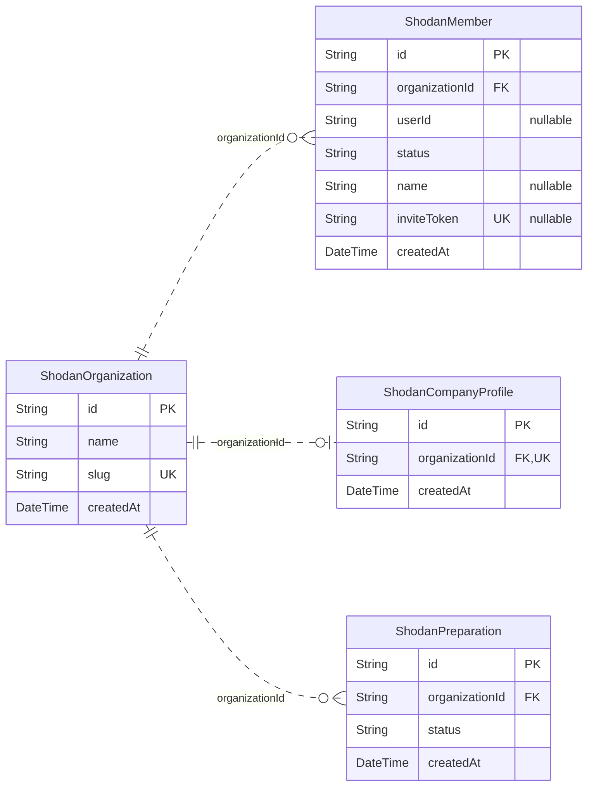
```mermaid
erDiagram
    direction LR
    ShodanOrganization {
        String id PK
        String name
        String slug UK
        DateTime createdAt
    }
    ShodanMember {
        String id PK
        String organizationId FK
        String userId "nullable"
        String status
        String name "nullable"
        String inviteToken UK "nullable"
        DateTime createdAt
    }
    ShodanCompanyProfile {
        String id PK
        String organizationId FK,UK
        DateTime createdAt
    }
    ShodanPreparation {
        String id PK
        String organizationId FK
        String status
        DateTime createdAt
    }
    ShodanOrganization ||..o{ ShodanMember : "organizationId"
    ShodanOrganization ||..o| ShodanCompanyProfile : "organizationId"
    ShodanOrganization ||..o{ ShodanPreparation : "organizationId"
```

## ドヤAIO

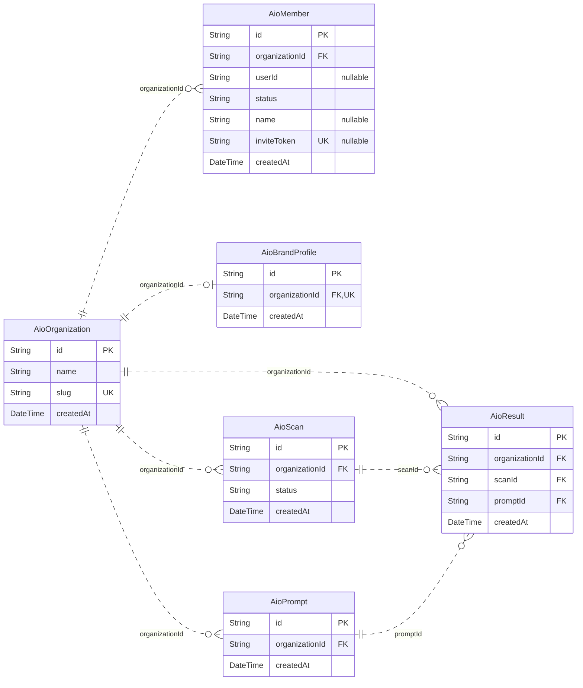
```mermaid
erDiagram
    direction LR
    AioOrganization {
        String id PK
        String name
        String slug UK
        DateTime createdAt
    }
    AioMember {
        String id PK
        String organizationId FK
        String userId "nullable"
        String status
        String name "nullable"
        String inviteToken UK "nullable"
        DateTime createdAt
    }
    AioBrandProfile {
        String id PK
        String organizationId FK,UK
        DateTime createdAt
    }
    AioPrompt {
        String id PK
        String organizationId FK
        DateTime createdAt
    }
    AioScan {
        String id PK
        String organizationId FK
        String status
        DateTime createdAt
    }
    AioResult {
        String id PK
        String organizationId FK
        String scanId FK
        String promptId FK
        DateTime createdAt
    }
    AioOrganization ||..o{ AioMember : "organizationId"
    AioOrganization ||..o| AioBrandProfile : "organizationId"
    AioOrganization ||..o{ AioPrompt : "organizationId"
    AioOrganization ||..o{ AioScan : "organizationId"
    AioOrganization ||..o{ AioResult : "organizationId"
    AioScan ||..o{ AioResult : "scanId"
    AioPrompt ||..o{ AioResult : "promptId"
```

## ドヤ面接官

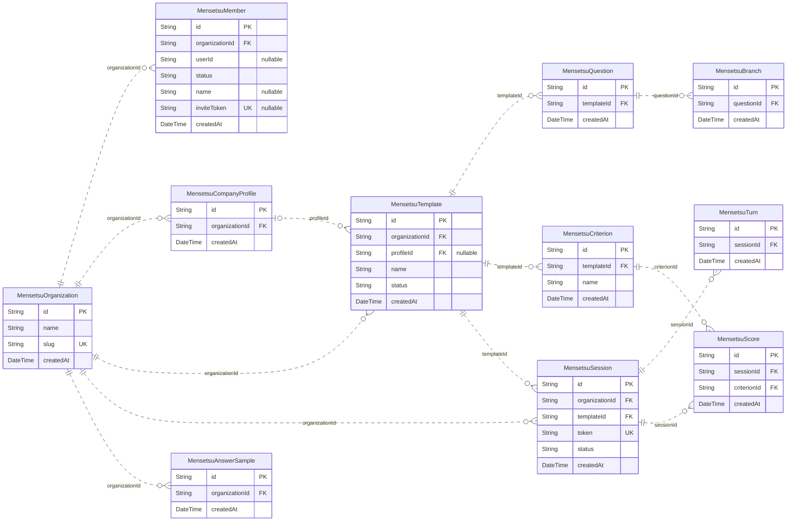
```mermaid
erDiagram
    direction LR
    MensetsuOrganization {
        String id PK
        String name
        String slug UK
        DateTime createdAt
    }
    MensetsuMember {
        String id PK
        String organizationId FK
        String userId "nullable"
        String status
        String name "nullable"
        String inviteToken UK "nullable"
        DateTime createdAt
    }
    MensetsuCompanyProfile {
        String id PK
        String organizationId FK
        DateTime createdAt
    }
    MensetsuTemplate {
        String id PK
        String organizationId FK
        String profileId FK "nullable"
        String name
        String status
        DateTime createdAt
    }
    MensetsuQuestion {
        String id PK
        String templateId FK
        DateTime createdAt
    }
    MensetsuBranch {
        String id PK
        String questionId FK
        DateTime createdAt
    }
    MensetsuCriterion {
        String id PK
        String templateId FK
        String name
        DateTime createdAt
    }
    MensetsuSession {
        String id PK
        String organizationId FK
        String templateId FK
        String token UK
        String status
        DateTime createdAt
    }
    MensetsuTurn {
        String id PK
        String sessionId FK
        DateTime createdAt
    }
    MensetsuScore {
        String id PK
        String sessionId FK
        String criterionId FK
        DateTime createdAt
    }
    MensetsuAnswerSample {
        String id PK
        String organizationId FK
        DateTime createdAt
    }
    MensetsuOrganization ||..o{ MensetsuMember : "organizationId"
    MensetsuOrganization ||..o{ MensetsuCompanyProfile : "organizationId"
    MensetsuOrganization ||..o{ MensetsuTemplate : "organizationId"
    MensetsuCompanyProfile |o..o{ MensetsuTemplate : "profileId"
    MensetsuTemplate ||..o{ MensetsuQuestion : "templateId"
    MensetsuQuestion ||..o{ MensetsuBranch : "questionId"
    MensetsuTemplate ||..o{ MensetsuCriterion : "templateId"
    MensetsuOrganization ||..o{ MensetsuSession : "organizationId"
    MensetsuTemplate ||..o{ MensetsuSession : "templateId"
    MensetsuSession ||..o{ MensetsuTurn : "sessionId"
    MensetsuSession ||..o{ MensetsuScore : "sessionId"
    MensetsuCriterion ||..o{ MensetsuScore : "criterionId"
    MensetsuOrganization ||..o{ MensetsuAnswerSample : "organizationId"
```

## ドヤ見積もりAI

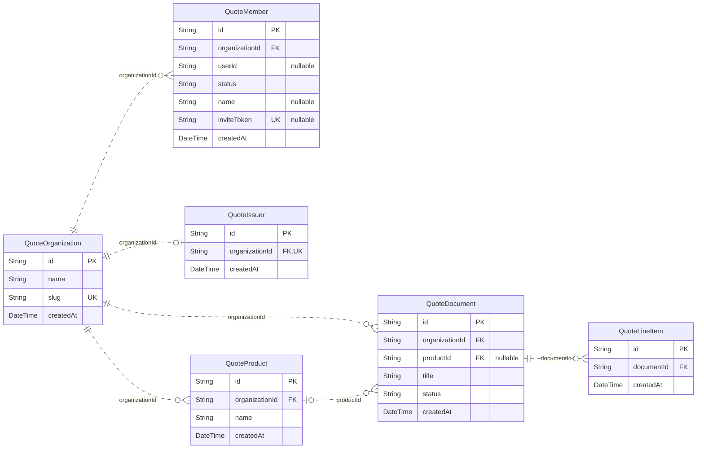
```mermaid
erDiagram
    direction LR
    QuoteOrganization {
        String id PK
        String name
        String slug UK
        DateTime createdAt
    }
    QuoteMember {
        String id PK
        String organizationId FK
        String userId "nullable"
        String status
        String name "nullable"
        String inviteToken UK "nullable"
        DateTime createdAt
    }
    QuoteIssuer {
        String id PK
        String organizationId FK,UK
        DateTime createdAt
    }
    QuoteProduct {
        String id PK
        String organizationId FK
        String name
        DateTime createdAt
    }
    QuoteDocument {
        String id PK
        String organizationId FK
        String productId FK "nullable"
        String title
        String status
        DateTime createdAt
    }
    QuoteLineItem {
        String id PK
        String documentId FK
        DateTime createdAt
    }
    QuoteOrganization ||..o{ QuoteMember : "organizationId"
    QuoteOrganization ||..o| QuoteIssuer : "organizationId"
    QuoteOrganization ||..o{ QuoteProduct : "organizationId"
    QuoteOrganization ||..o{ QuoteDocument : "organizationId"
    QuoteProduct |o..o{ QuoteDocument : "productId"
    QuoteDocument ||..o{ QuoteLineItem : "documentId"
```

## ドヤAI商談

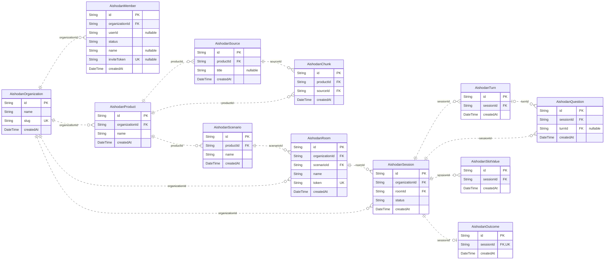
```mermaid
erDiagram
    direction LR
    AishodanOrganization {
        String id PK
        String name
        String slug UK
        DateTime createdAt
    }
    AishodanMember {
        String id PK
        String organizationId FK
        String userId "nullable"
        String status
        String name "nullable"
        String inviteToken UK "nullable"
        DateTime createdAt
    }
    AishodanProduct {
        String id PK
        String organizationId FK
        String name
        DateTime createdAt
    }
    AishodanSource {
        String id PK
        String productId FK
        String title "nullable"
        DateTime createdAt
    }
    AishodanChunk {
        String id PK
        String productId FK
        String sourceId FK
        DateTime createdAt
    }
    AishodanScenario {
        String id PK
        String productId FK
        String name
        DateTime createdAt
    }
    AishodanRoom {
        String id PK
        String organizationId FK
        String scenarioId FK
        String name
        String token UK
        DateTime createdAt
    }
    AishodanSession {
        String id PK
        String organizationId FK
        String roomId FK
        String status
        DateTime createdAt
    }
    AishodanTurn {
        String id PK
        String sessionId FK
        DateTime createdAt
    }
    AishodanQuestion {
        String id PK
        String sessionId FK
        String turnId FK "nullable"
        DateTime createdAt
    }
    AishodanSlotValue {
        String id PK
        String sessionId FK
        DateTime createdAt
    }
    AishodanOutcome {
        String id PK
        String sessionId FK,UK
        DateTime createdAt
    }
    AishodanOrganization ||..o{ AishodanMember : "organizationId"
    AishodanOrganization ||..o{ AishodanProduct : "organizationId"
    AishodanProduct ||..o{ AishodanSource : "productId"
    AishodanProduct ||..o{ AishodanChunk : "productId"
    AishodanSource ||..o{ AishodanChunk : "sourceId"
    AishodanProduct ||..o{ AishodanScenario : "productId"
    AishodanOrganization ||..o{ AishodanRoom : "organizationId"
    AishodanScenario ||..o{ AishodanRoom : "scenarioId"
    AishodanOrganization ||..o{ AishodanSession : "organizationId"
    AishodanRoom ||..o{ AishodanSession : "roomId"
    AishodanSession ||..o{ AishodanTurn : "sessionId"
    AishodanSession ||..o{ AishodanQuestion : "sessionId"
    AishodanTurn |o..o{ AishodanQuestion : "turnId"
    AishodanSession ||..o{ AishodanSlotValue : "sessionId"
    AishodanSession ||..o| AishodanOutcome : "sessionId"
```

## ドヤ広告画像AI

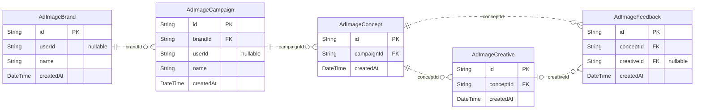
```mermaid
erDiagram
    direction LR
    AdImageBrand {
        String id PK
        String userId "nullable"
        String name
        DateTime createdAt
    }
    AdImageCampaign {
        String id PK
        String brandId FK
        String userId "nullable"
        String name
        DateTime createdAt
    }
    AdImageConcept {
        String id PK
        String campaignId FK
        DateTime createdAt
    }
    AdImageCreative {
        String id PK
        String conceptId FK
        DateTime createdAt
    }
    AdImageFeedback {
        String id PK
        String conceptId FK
        String creativeId FK "nullable"
        DateTime createdAt
    }
    AdImageBrand ||..o{ AdImageCampaign : "brandId"
    AdImageCampaign ||..o{ AdImageConcept : "campaignId"
    AdImageConcept ||..o{ AdImageCreative : "conceptId"
    AdImageConcept ||..o{ AdImageFeedback : "conceptId"
    AdImageCreative |o..o{ AdImageFeedback : "creativeId"
```

## 運営・メール配信

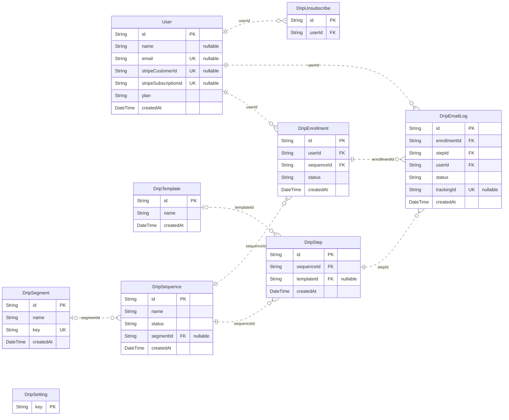
```mermaid
erDiagram
    direction LR
    User {
        String id PK
        String name "nullable"
        String email UK "nullable"
        String stripeCustomerId UK "nullable"
        String stripeSubscriptionId UK "nullable"
        String plan
        DateTime createdAt
    }
    DripSegment {
        String id PK
        String name
        String key UK
        DateTime createdAt
    }
    DripTemplate {
        String id PK
        String name
        DateTime createdAt
    }
    DripSequence {
        String id PK
        String name
        String status
        String segmentId FK "nullable"
        DateTime createdAt
    }
    DripStep {
        String id PK
        String sequenceId FK
        String templateId FK "nullable"
        DateTime createdAt
    }
    DripEnrollment {
        String id PK
        String userId FK
        String sequenceId FK
        String status
        DateTime createdAt
    }
    DripEmailLog {
        String id PK
        String enrollmentId FK
        String stepId FK
        String userId FK
        String status
        String trackingId UK "nullable"
        DateTime createdAt
    }
    DripUnsubscribe {
        String id PK
        String userId FK
    }
    DripSetting {
        String key PK
    }
    DripSegment |o..o{ DripSequence : "segmentId"
    DripSequence ||..o{ DripStep : "sequenceId"
    DripTemplate |o..o{ DripStep : "templateId"
    User ||..o{ DripEnrollment : "userId"
    DripSequence ||..o{ DripEnrollment : "sequenceId"
    DripEnrollment ||..o{ DripEmailLog : "enrollmentId"
    DripStep ||..o{ DripEmailLog : "stepId"
    User ||..o{ DripEmailLog : "userId"
    User ||..o{ DripUnsubscribe : "userId"
```

## 関連機能：ドヤマナ

```mermaid
erDiagram
    direction LR
    DoyamanaCategory {
        String id PK
        String name
        String slug UK
        DateTime createdAt
    }
    DoyamanaImage {
        String id PK
        String categoryId FK
        DateTime createdAt
    }
    DoyamanaUsageLog {
        String id PK
        String imageId FK
        String userId "nullable"
        String serviceId "nullable"
        DateTime createdAt
    }
    DoyamanaCategory ||..o{ DoyamanaImage : "categoryId"
    DoyamanaImage ||..o{ DoyamanaUsageLog : "imageId"
```

## 関連定義：戦略プロジェクト

```mermaid
erDiagram
    direction LR
    User {
        String id PK
        String name "nullable"
        String email UK "nullable"
        String stripeCustomerId UK "nullable"
        String stripeSubscriptionId UK "nullable"
        String plan
        DateTime createdAt
    }
    StrategyProject {
        String id PK
        String userId FK "nullable"
        String title "nullable"
        String status
        DateTime createdAt
    }
    User |o..o{ StrategyProject : "userId"
```

## ドヤワイヤーフレーム AI

```mermaid
erDiagram
    direction LR
    User {
        String id PK
        String name "nullable"
        String email UK "nullable"
        String stripeCustomerId UK "nullable"
        String stripeSubscriptionId UK "nullable"
        String plan
        DateTime createdAt
    }
    LpProject {
        String id PK
        String userId FK
        String name
        String status
        DateTime createdAt
    }
    LpSection {
        String id PK
        String projectId FK
        String name
        DateTime createdAt
    }
    User ||..o{ LpProject : "userId"
    LpProject ||..o{ LpSection : "projectId"
```

## ドヤ展開AI

```mermaid
erDiagram
    direction LR
    User {
        String id PK
        String name "nullable"
        String email UK "nullable"
        String stripeCustomerId UK "nullable"
        String stripeSubscriptionId UK "nullable"
        String plan
        DateTime createdAt
    }
    TenkaiProject {
        String id PK
        String userId FK
        String title
        String status
        DateTime createdAt
    }
    TenkaiOutput {
        String id PK
        String projectId FK
        String status
        String brandVoiceId FK "nullable"
        DateTime createdAt
    }
    TenkaiBrandVoice {
        String id PK
        String userId FK
        String name
        DateTime createdAt
    }
    TenkaiTemplate {
        String id PK
        String userId FK "nullable"
        String name
        DateTime createdAt
    }
    TenkaiUsage {
        String id PK
        String userId FK
        DateTime createdAt
    }
    TenkaiApiKey {
        String id PK
        String userId FK
        DateTime createdAt
    }
    User ||..o{ TenkaiProject : "userId"
    TenkaiProject ||..o{ TenkaiOutput : "projectId"
    TenkaiBrandVoice |o..o{ TenkaiOutput : "brandVoiceId"
    User ||..o{ TenkaiBrandVoice : "userId"
    User |o..o{ TenkaiTemplate : "userId"
    User ||..o{ TenkaiUsage : "userId"
    User ||..o{ TenkaiApiKey : "userId"
```

## ドヤコピーAI

```mermaid
erDiagram
    direction LR
    User {
        String id PK
        String name "nullable"
        String email UK "nullable"
        String stripeCustomerId UK "nullable"
        String stripeSubscriptionId UK "nullable"
        String plan
        DateTime createdAt
    }
    CopyBrandVoice {
        String id PK
        String userId FK
        String name
        DateTime createdAt
    }
    CopyProject {
        String id PK
        String userId FK "nullable"
        String name
        String status
        String brandVoiceId FK "nullable"
        DateTime createdAt
    }
    CopyItem {
        String id PK
        String projectId FK
        DateTime createdAt
    }
    User ||..o{ CopyBrandVoice : "userId"
    User |o..o{ CopyProject : "userId"
    CopyBrandVoice |o..o{ CopyProject : "brandVoiceId"
    CopyProject ||..o{ CopyItem : "projectId"
```

## ドヤオープニングAI

```mermaid
erDiagram
    direction LR
    User {
        String id PK
        String name "nullable"
        String email UK "nullable"
        String stripeCustomerId UK "nullable"
        String stripeSubscriptionId UK "nullable"
        String plan
        DateTime createdAt
    }
    OpeningProject {
        String id PK
        String userId FK "nullable"
        String status
        DateTime createdAt
    }
    OpeningAnimation {
        String id PK
        String projectId FK
        DateTime createdAt
    }
    User |o..o{ OpeningProject : "userId"
    OpeningProject ||..o{ OpeningAnimation : "projectId"
```

## ドヤボイスAI

```mermaid
erDiagram
    direction LR
    User {
        String id PK
        String name "nullable"
        String email UK "nullable"
        String stripeCustomerId UK "nullable"
        String stripeSubscriptionId UK "nullable"
        String plan
        DateTime createdAt
    }
    VoiceProject {
        String id PK
        String userId FK
        String name
        String status
        DateTime createdAt
    }
    VoiceRecording {
        String id PK
        String projectId FK
        DateTime createdAt
    }
    User ||..o{ VoiceProject : "userId"
    VoiceProject ||..o{ VoiceRecording : "projectId"
```

## ドヤヒヤリングAI

```mermaid
erDiagram
    direction LR
    User {
        String id PK
        String name "nullable"
        String email UK "nullable"
        String stripeCustomerId UK "nullable"
        String stripeSubscriptionId UK "nullable"
        String plan
        DateTime createdAt
    }
    InterviewXProject {
        String id PK
        String userId FK
        String title
        String templateId FK "nullable"
        String status
        String shareToken UK
        DateTime createdAt
    }
    InterviewXTemplate {
        String id PK
        String name
        String userId "nullable"
        DateTime createdAt
    }
    InterviewXQuestion {
        String id PK
        String projectId FK
        DateTime createdAt
    }
    InterviewXResponse {
        String id PK
        String projectId FK
        String status
    }
    InterviewXAnswer {
        String id PK
        String responseId FK
        String questionId FK
        DateTime createdAt
    }
    InterviewXDraft {
        String id PK
        String projectId FK
        String title "nullable"
        String status
        DateTime createdAt
    }
    InterviewXFeedback {
        String id PK
        String projectId FK
        String draftId FK "nullable"
        DateTime createdAt
    }
    InterviewXCheck {
        String id PK
        String projectId FK
        String draftId FK
        DateTime createdAt
    }
    InterviewXChatMessage {
        String id PK
        String responseId FK
        DateTime createdAt
    }
    User ||..o{ InterviewXProject : "userId"
    InterviewXTemplate |o..o{ InterviewXProject : "templateId"
    InterviewXProject ||..o{ InterviewXQuestion : "projectId"
    InterviewXProject ||..o{ InterviewXResponse : "projectId"
    InterviewXResponse ||..o{ InterviewXAnswer : "responseId"
    InterviewXQuestion ||..o{ InterviewXAnswer : "questionId"
    InterviewXProject ||..o{ InterviewXDraft : "projectId"
    InterviewXProject ||..o{ InterviewXFeedback : "projectId"
    InterviewXDraft |o..o{ InterviewXFeedback : "draftId"
    InterviewXProject ||..o{ InterviewXCheck : "projectId"
    InterviewXDraft ||..o{ InterviewXCheck : "draftId"
    InterviewXResponse ||..o{ InterviewXChatMessage : "responseId"
```

## ドヤムービーAI

```mermaid
erDiagram
    direction LR
    User {
        String id PK
        String name "nullable"
        String email UK "nullable"
        String stripeCustomerId UK "nullable"
        String stripeSubscriptionId UK "nullable"
        String plan
        DateTime createdAt
    }
    MovieProject {
        String id PK
        String userId FK "nullable"
        String name
        String status
        DateTime createdAt
    }
    MovieScene {
        String id PK
        String projectId FK
    }
    MovieRenderJob {
        String id PK
        String projectId FK
        String status
        DateTime createdAt
    }
    User |o..o{ MovieProject : "userId"
    MovieProject ||..o{ MovieScene : "projectId"
    MovieProject ||..o{ MovieRenderJob : "projectId"
```

## ドヤ広告シミュレーションAI

```mermaid
erDiagram
    direction LR
    User {
        String id PK
        String name "nullable"
        String email UK "nullable"
        String stripeCustomerId UK "nullable"
        String stripeSubscriptionId UK "nullable"
        String plan
        DateTime createdAt
    }
    AdSimProject {
        String id PK
        String userId FK "nullable"
        String name
        String status
        DateTime createdAt
    }
    User |o..o{ AdSimProject : "userId"
```

## ドヤ広告バナーAI

```mermaid
erDiagram
    direction LR
    AdBannerCampaign {
        String id PK
        String userId "nullable"
        String name
        DateTime createdAt
    }
    AdBannerCreative {
        String id PK
        String campaignId FK
        DateTime createdAt
    }
    AdBannerCampaign ||..o{ AdBannerCreative : "campaignId"
```

## 別事業：三ツ星ナグサメ

```mermaid
erDiagram
    direction LR
    User {
        String id PK
        String name "nullable"
        String email UK "nullable"
        String stripeCustomerId UK "nullable"
        String stripeSubscriptionId UK "nullable"
        String plan
        DateTime createdAt
    }
    MitsuboshiNagusamePost {
        String id PK
        String userId FK "nullable"
        DateTime createdAt
    }
    MitsuboshiNagusameReply {
        String id PK
        String postId FK
        DateTime createdAt
    }
    MitsuboshiNagusameSubscription {
        String id PK
        String userId FK,UK
        String plan
        String stripeSubId UK "nullable"
        DateTime createdAt
    }
    User |o..o{ MitsuboshiNagusamePost : "userId"
    MitsuboshiNagusamePost ||..o{ MitsuboshiNagusameReply : "postId"
    User ||..o| MitsuboshiNagusameSubscription : "userId"
```

## 参照元

- prisma/schema.prisma（本書の正本）
- src/lib/services.ts（公開区分・サービス名）
- reference/11-billing-spec.md（課金不変条件）
- src/app/api/banner/generate/route.ts（共通Generation利用）
- src/app/api/persona/generate/route.ts（ペルソナの利用ログ記録）

旧 reference/04-database.md のモデル数・課金制約には現スキーマとの不一致があるため、本資料では現スキーマを採用。